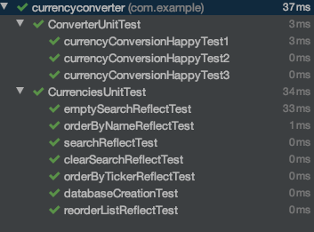
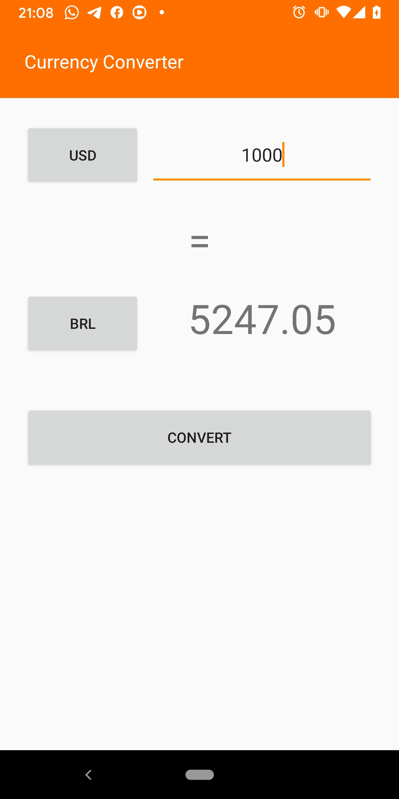
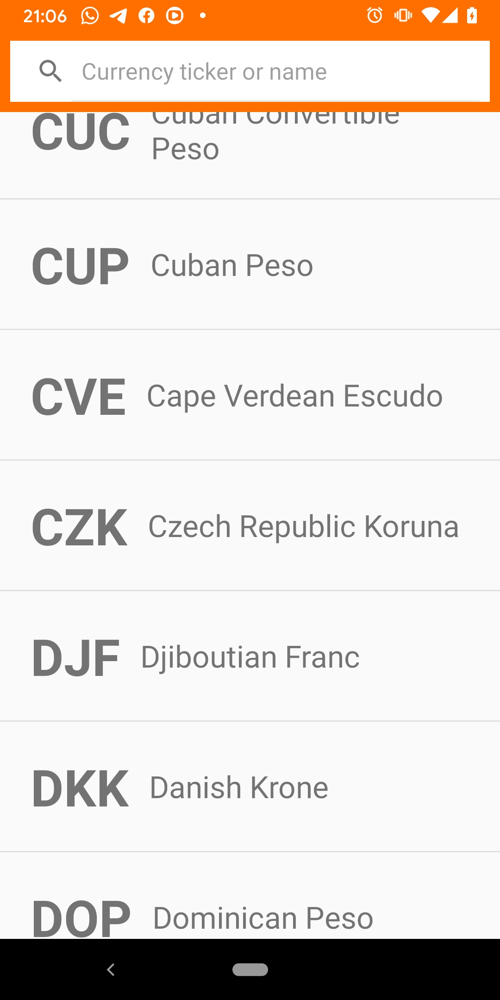
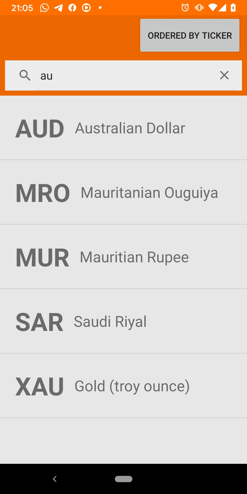
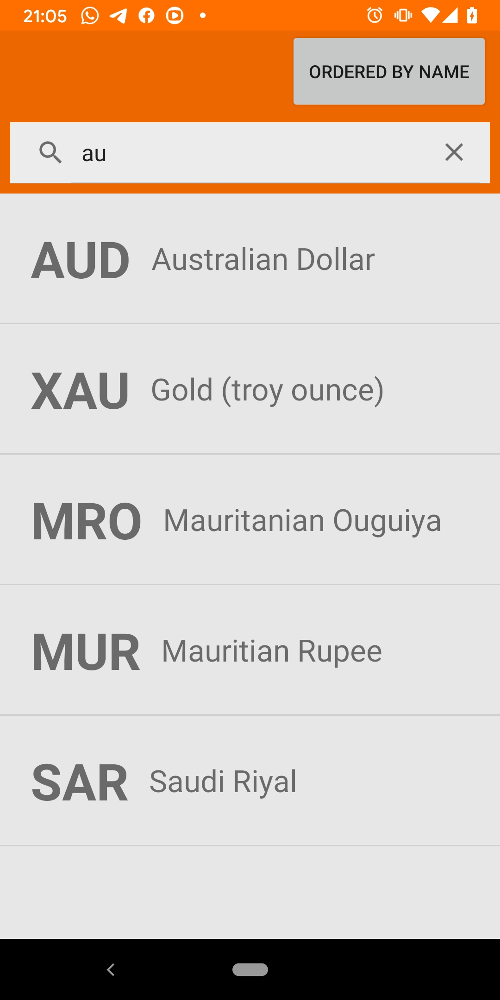
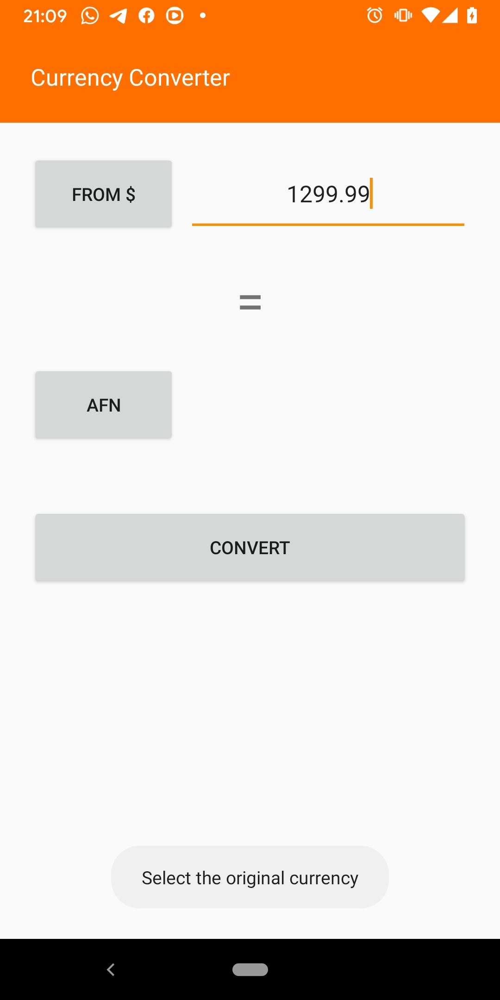
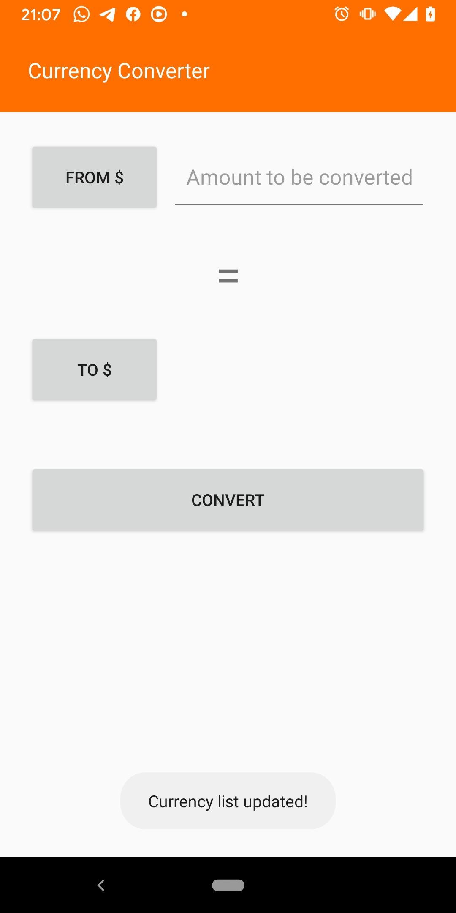

# Currency Converter

This sample Android app is made using **Kotlin** and **Clean Architecture**.
The objective is to implement a **Currency Converter** using the [API CurrencyLayer](https://currencylayer.com/documentation)
The app has only two screens: 
   * The Conversion screen
   * The List of all available currencies screen

We are using Gradle as dependency manager and the following dependencies:
   * Retrofit for managing the API requests
   * Realm for persisting offline data (tried room but got some crashes)
   * RxJava for dealing with threads (tried coroutines but got some crashes)
   * JUnit for Unit testing

## Clean Architecture Design Pattern

The **Clean Architecture** provides a modular implementation of the features, making code decoupled with this design pattern will help if we need to change technology in the future, also helps in code reuse and unit-test writing.


The circles represent different levels of software in your app. There are two key things to note:
 
* The center circle is the most abstract, and the outer circle is the most concrete. This is called the **Abstraction Principle**. The Abstraction Principle specifies that inner circles should contain business logic, and outer circles should contain implementation details.
Another principle of Clean Architecture is the Dependency Rule. This rule specifies that each circle can depend only on the nearest inward circle — this is what makes the architecture work.
* The outer circle represents the concrete mechanisms that are specific to the platform such as networking and database access. Moving inward, each circle is more abstract and higher-level. The center circle is the most abstract and contains business logic, which doesn’t rely on the platform or the framework you’re using.

Additional benefits of using an architecture when structuring app code include:

* Parts of the code get decoupled, and easier to reuse and test.
* There’s a method to the madness. When someone else works on your code, they can learn the app’s architecture and will understand it better.

*See more about Clean in [RayWenderlich.com](https://www.raywenderlich.com/3595916-clean-architecture-tutorial-for-android-getting-started)*

We can see in the picture below that the project code is structured in packages, following the Clean architecture pattern.


* We use the "Entity" package, where we store our models, and this package is only Kotlin, not aware of what other data sources or devices and platforms we are using.
* Also, wrapping the models, we have the business use cases, as interactors in a package called "Logic"
* And in the most external layer we have our view related content in a package called "Presentation" and the Database and Networking related classes in another package called Infrastructure"

## Code details

### Decoupling using interfaces

Using interfaces makes the code decoupled because we don't define big overloaded classes anymore. We first define which are the behaviors of each module and then objects can implement one or more interfaces. For simplicity, I have used interfaces only for the **Presentation** and **Infrastructure** layers, but it could also be extended to Interactors in the **Logic** layer.
See below an example of an interface for something called ConverterView, which is a piece of UI responsible for converting the currencies:

*Example from ConverterView.kt*
```java
interface ConverterView {
    fun setOriginalValueText(text: String)
    fun onOriginalCurrencyButtonClick(view : View)
    fun onConvertedCurrencyButtonClick(view: View)
    fun onConvertButtonClick(view: View)
    fun setOriginalCurrencyButtonText(text : String)
    fun setConvertedCurrencyButtonText(text : String)
    fun setConvertedValueText(text : String)
    fun showCurrencyList(requestCode : Int)
    fun showToast(message: String)
}
```

### Dumb Views with single responsability

Our Activities are the Views of the UI. That's all they do. Their responsibility is to show things to the user and recieve inputs from him/her. See the code below, extracted from our Activities, how simple their methods became:

*Example from ConverterActivity.kt*
```java
    override fun onConvertedCurrencyButtonClick(view: View) {
        converterInteractor?.selectTargetCurrency()
    }

    override fun onConvertButtonClick(view: View) {
        converterInteractor?.convert()
    }

    override fun setOriginalCurrencyButtonText(text: String) {
        originalCurrencyButton.text = text
    }

    override fun setConvertedCurrencyButtonText(text: String) {
        convertedCurrencyButton.text = text
    }

    override fun setConvertedValueText(text : String) {
        convertedValueTextView.text = text
    }

    override fun showCurrencyList(requestCode: Int) {
        startActivityForResult(Intent(this, CurrenciesActivity::class.java), requestCode)
    }

    override fun showToast(message: String) {
        Toast.makeText(this, message, Toast.LENGTH_LONG).show()
    }

    override fun onDestroy() {
        compositeDisposable.dispose()
        converterInteractor?.onDestroy()
        super.onDestroy()
    }
```

### Testable logic with the Interactors

Decoupling the app logic from the Activities is useful not only because it makes it easier to replace layers and methods, but also makes the code more testable. That's what we want to achieve with the Interactors being called in a layer that is different from the Views. Below are some methods written in the Interactors, note how they only do singular things and don't deal with the UI. When any UI action is needed, they call the Views in the presentation layer.

*Example from CurrenciesInteractor.kt*
```java
   fun reorderList() {
         if (currentOrder == ORDER_TICKER) orderByName() else orderByTicker()
   }

   fun onCurrencySelected(selectedCurrency: Currency) {
        view.finishWithResultingCurrency(selectedCurrency)
   }

   fun clearSearch() {
        currentQuery = ""
        view.setRecyclerViewArray(ArrayList(database.getCurrencies()))
   }
```

### Unit-Testing the logic

The objective here is not to give full code coverage, which would be time-consuming, but only exemplify how we structure the unit tests and mocks to work with the interactors.
Inside the test project, we can find those examples. The purpose is to call some methods in the interactors and test their behaviors in terms of processed data or their outputs to other mocked units. We can apply this kind of test in practically all the app structures, given the app is very decoupled and our methods do just a few things in their given scope.



## How the app works

Basically the app presents the user two buttons for selecting the original and target currencies, a field for entering the original amount to be converted, and a large "Convert" button.
When the user fulfills the fields and tap on "Convert", the converted value appears on the screen within highlight.

### The home screen (ConverterActivity)

The Converter screen is shown below, the user needs to fulfill all the fields to be able to convert. 
If the user presses the "From $" and "To $" buttons, he/she is redirected to a currency list to select the desired currency.



### The currencies list (CurrenciesActivity)

When the user is selecting the desired currency, he/she will be able to see a list of all the available currency with tickers and names as presented in the picture below.
The user is also able to search and order the names/tickers.



### Searching for currencies

User can search for currency ticker (symbol) or by name as shown in picture below:


### Ordering the search list

The search result (or the entire list) can be ordered by the currency ticker (Symbol) or Name by clicking in the button above the searchbar, as show in the picture below:

 

### Error treatment

If the user is offline or if any field is missing when he/she taps "Convert", the user will be presented a "Toast" saying what is missing.
There is also a "Toast" when the database gets refreshed with live quotes from the API. This occurs, by the economy, every time the ConverterActivity gets created.

 

## Running the project

To run this project you will need the software Android Studio.
- Just Clone or Download the project, then open its directory with Android Studio.
- Wait for a little for Android Studio to find the packages and Gradle to install de dependencies.
- You should be prompted to install missing APIs, that's ok, you can download them.
- After syncing and package installations, you should be able to click in the RUN the app on Emulator or attached Device.

*If you have trouble, refer to [developer.android.com/studio/run](https://developer.android.com/studio/run)*

## Problems faced

### Using room and coroutines

I really tried to make androidx's room for data persistence and coroutines for dealing with async threads. Although my code worked, I had some stability issues when running the app for a couple of seconds. The app suddenly crashed. So I preferred to replace room with Realm and coroutines with Rx (ReactiveX), which were more in my professional comfort zone.
Because the app is really made on modules, it was not difficult to replace both. In case we find a good choice in the future, we could try any other solutions, but for the moment it is working fine.

### Troubleshooting

* Sometimes I had problems with the Android Emulator when trying to get the data from api.currencylayer.com. (No address associated with hostname). This is probably because in the free account we cannot call https access, only http. I was able to correctly get the currencies by running on a real device.

