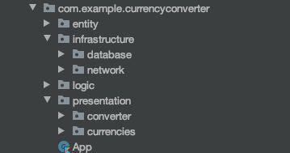

# Currency Converter

This sample Android app is made using *Kotlin* and *Clean Architecture*.
The objective is to implement a *Currency Converter* using the [API CurrencyLayer](https://currencylayer.com/documentation)
The app has only two screens: 
   * The convertion screen
   * The List of all available currencies screen

We are using Gradle as dependency manager and the following dependencies:
   * Retrofit for managing the API requests
   * Room for persisting offline data
   * Couroutines when dealing with threads
   * JUnit for Unit testing

## Clean Architecture Design Pattern

Clean architecture provides a modular implementation of the features, making code decoupled with this design pattern will help if we need to change technology in future, also helps in code reuse and unit-test writing.

We can see in the picture below that the project code is structured in packages, following the Clean architecture pattern.
* Se use the "Entity" package, where we store our models, and this package is only Kotlin, not aware of what other data sources or devices and platforms we are using.
* Also, wrapping the models, we have the business user cases, as interactors in a package called "Logic"
* And in the most external layer we have our view related content in a package called "Presentation" and the Database and Networking related classes in another package called Infrastructure"
