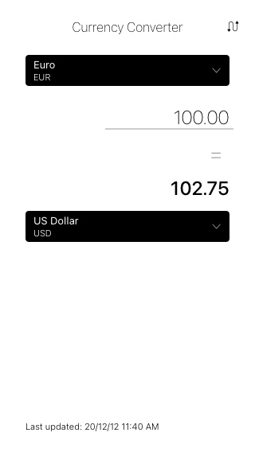
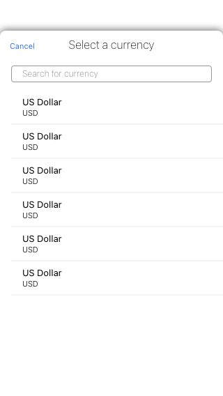

# Planejamento da solução

## Referências

Primeiramente, busquei referências em outros aplicativos de conversão de moeda para entender principalmente a experiência do usuário em cada. Dessa forma, selecionei os seguintes para análise:
 - [My Currency Converter & Rates](https://apps.apple.com/us/app/my-currency-converter/id549019596)
 - [Xe Currency & Money Transfer](https://apps.apple.com/app/apple-store/id315241195?mt=8) 

### My Currency Converter & Rates

Analisando a função de conversão de moedas, é fácil identificar onde posso digitar o valor e para quais moedas está sendo convertido. O uso destacado da bandeira e nome da moeda facilitam esse entendimento.

Há também a informação da última vez em que as taxas de conversão foram atualizadas. Esse dado não é destacado na interface e faz sentido ser dessa maneira, pois é relevante, porém não está no topo da hierarquia de informação.

### Xe Currency & Money Transfer

Um app bem objetivo, sua tela principal se assemelha a uma calculadora e com isso deixa rapidamente acessivel ao usuário a sua principal funcionalidade.

Também deixa a mostra o valor da taxa de conversão entre as moedas, além também da informação da data da última atualização dos valores das taxas. Da mesma forma que o anterior, essas informações estão mais abaixo na hierarquia de informação e por isso não são destacadas.

---

## Interface planejada

Baseando-me nos pontos levantados nas análises das referências, procurei montar uma interface simples e direta, considerando também os dados que a API da currencylayer fornece. 

Dessa forma, procurei deixar claro quais as moedas estão selecionadas para a conversão, qual o campo que usuário irá informar o valor e o resultado da conversão. Também deixei disponivel um botão de atalho para troca das moedas, bem como a informação de quando foi realizada a última atualização das taxas.

### Protótipo da interface

 

---

## Desenvolvimento

Procurei focar primeiramente na base do projeto, estruturando grupos e arquivos do projeto e adicionando implementações de utilidade que planejava utilizar. Como extensões de classes para facilitar **view coding** e uso de **constraints**.

Após isso, procurei replicar a interface projetada, implementando componentes reutilizáveis e as views planejadas. Posteriormente segui para a implementação da camada de serviço.

Devido a só conseguir ter a disponibilidade de 3 dias para desenvolver esse projeto (por questões pessoais), priorizei e optei por implementar esses 3 itens:
- Desenvolver o app seguindo a arquitetura MVVM
- Funcionalidade de busca na lista de moedas por nome ou sigla da moeda
- Desenvolver testes unitários

Por fim, planejava mais alguns pontos, porém não foram implementados. Estes seriam:
- Adição da informação da última atualização no rodapé da tela inicial (como planejado na interface)
- Melhoria no tratamento de erros
- Ordenação da lista de moedas
- Mais casos e melhorias nos testes unitários